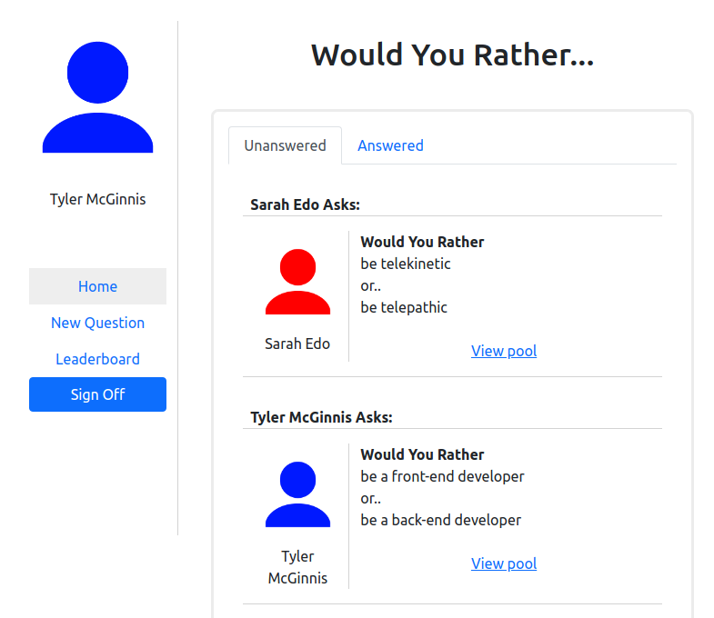
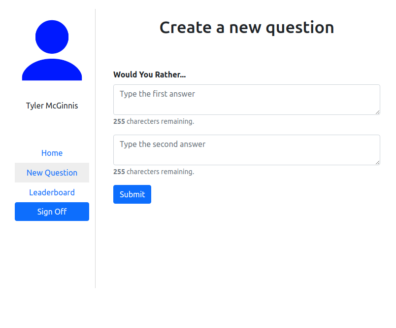

# Would you rather Overview
The "Would You Rather?" Project is a web app that lets a user play the “Would You Rather?” game.

The game goes like this: A user is asked a question in the form: “Would you rather [option A] or [option B] ?”.

Answering "neither" or "both" is against the rules.

In the app, users are be able to answer questions, see which questions they haven’t answered, see how other people have voted, post questions, and see the ranking of users on the leaderboard.


## Installing and launching the project.

- Install the requirements:
```shell
npm install
```
- Launch the web app
```shell
npm run
```

## Screenshots



